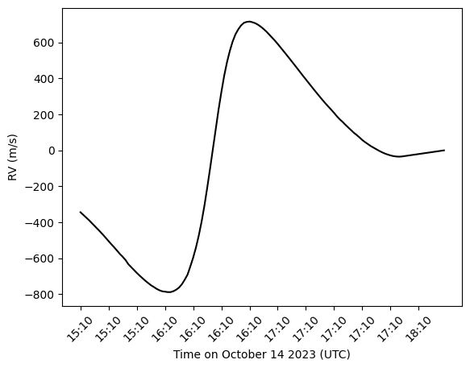

#  GRASS-E

GRASS (GRanulation And Spectrum Simulator) is a Julia package designed to produce time series of stellar spectra with realistic line-shape changes from solar granulation. GRASS v1.0.x is described in detail in [Palumbo et al. (2022)](https://arxiv.org/abs/2110.11839) and GRASS v2.0.x is presented in [Palumbo et al. (2024a)](https://arxiv.org/abs/2405.07945).

GRASS-E repurposes the GRASS software to produce granulation-driven solar spectra during a solar eclipse. GRASS-E is presented in Gonzalez et al. 2026. 

## Installation

GRASS-E is written entirely in Julia and requires Julia v1.9 or greater. Installation instructions for Julia are available from [julialang.org](https://julialang.org/downloads/).

GRASS-E itself only requires a few steps to install. Simply clone the repo to your desired directory...

```bash
git clone git@github.com:elizabethg60/GRASS-E.git
cd GRASS-E 
julia
```

... and then add it with Julia's built-in package manager, `Pkg`:

```julia
using Pkg
Pkg.add(path=".") # assuming you are in /PATH/TO/GRASS
using GRASS
```

If you wish to develop or otherwise contribute to GRASS-E, instead add the package in develop mode:

```julia
using Pkg
Pkg.develop(path=".") # assuming you are in /PATH/TO/GRASS
using GRASS
```

Upon first invocation of GRASS-E, Julia will automatically install the package dependencies and download the required input data. The input data can be re-installed by invoking

```julia
Pkg.build("GRASS")
```

Alternatively, these data can be directly downloaded from [Zenodo](https://zenodo.org/records/8271417).

## Basic CPU Example

```julia
using GRASS
using PyPlot
using DataFrames
using CSV

#NEID solar feed coordinates
obs_lat = 31.9583 
obs_long = -111.5967  
alt = 2.097938

# parameters for lines in the spectra
lines = [5434.5232]                 # array of line centers 
templates = ["FeI_5434"]            # template data to use
depths = [0.6]                      # array of line depths
variability = trues(length(lines))  # granulation signature toggle 
blueshifts = zeros(length(lines))   # set convective blueshift value
resolution = 7e5                    # spectral resolution
spec = GRASS.SpecParams(lines=lines, depths=depths, variability=variability, blueshifts=blueshifts, templates=templates, resolution=resolution) 

# read in NEID timestamps for October solar eclipse 
df = CSV.read("data/NEIDOctoberTimestamps.csv", DataFrame)
# specify number of epochs 
disk = GRASS.Eclipse.DiskParamsEclipse(Nt=length(df.UTC))

# specify limb darkening law to use
LD_type = "SSD_4parameter"
# specify optimized wavelength-dependent extinction coefficent  
ext_coeff = 0.15452995224327976

# synthesize the spectra
wavelengths, flux = GRASS.Eclipse.synthesize_spectra_eclipse(spec, disk, lines, LD_type, obs_long, obs_lat, alt, string.(df.UTC), ext_coeff, ext_toggle=true, use_gpu=false)
# compute radial velocities
wavs_sim, flux_sim = GRASS.convolve_gauss(wavelengths, flux, new_res=11e4)
v_grid_cpu, ccf_cpu = GRASS.calc_ccf(wavs_sim, flux_sim, lines, depths, 11e4)
rv_cpu, rv_error = GRASS.calc_rvs_from_ccf(v_grid_cpu, ccf_cpu)
```
